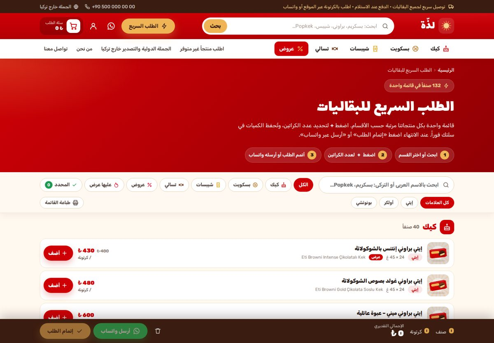
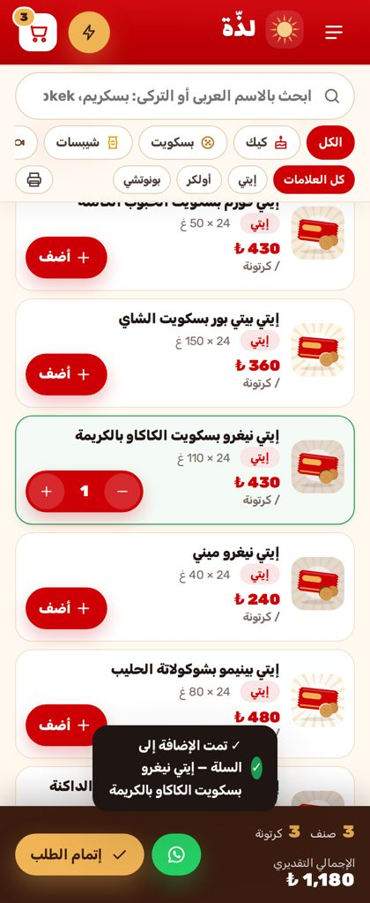

# قالب «لذّة» — متجر جملة الحلويات والتسالي للبقالات (ووردبريس + ووكومرس)

قالب ووردبريس عربي بالكامل (RTL) مبني خصيصاً لمتجر جملة يبيع **الكيك والبسكويت والشيبسات والتسالي** التركية لأصحاب البقاليات.
الهوية اللونية مستوحاة من **Eti**: الأحمر `#CE0006` والذهبي `#EFB455` مع درجات الكاكاو.

فكرة المتجر: ترسل رابط موقعك لصاحب البقالة، فيفتحه من جواله، ويحدد الكميات بالكرتونة، ويرسل الطلب خلال دقيقة.


| الطلب السريع (كمبيوتر) | الطلب السريع (جوال) |
|---|---|
|  |  |

---

## ماذا يحتوي القالب؟

- **5 أقسام جاهزة:** كيك، بسكويت، شيبسات، تسالي، عروض. يُحدَّث قسم العروض تلقائياً، فكل منتج عليه تخفيض يدخله وحده ويخرج منه عند انتهاء التخفيض.
- **132 منتجاً جاهزاً** من إيتي (57) وأولكر (56) وبونوتشي (15)، إضافة إلى 4 باقات عروض. لكل منتج اسم عربي والاسم التركي الأصلي والتعبئة وعدد القطع في الكرتونة والنكهة ووصف غني للسيو.
- **صفحة «الطلب السريع»:** كل المنتجات في قائمة واحدة، مع بحث فوري بالعربي أو التركي وتصفية حسب القسم والعلامة والعروض. زر + لكل صنف، وشريط سفلي يعرض عدد الأصناف والكراتين والإجمالي، مع زر «إتمام الطلب» وزر «أرسل عبر واتساب» برسالة جاهزة، وزر لطباعة قائمة الأسعار.
- **مزامنة فورية للسلة:** أي ضغطة على + أو − في أي مكان من الموقع تُحفظ في السلة مباشرة دون إعادة تحميل الصفحة.
- **صفحة «اطلب منتجاً غير متوفر»:** يطلب فيها صاحب البقالة أي منتج، حتى من خارج الحلويات، مع الكمية وصورة اختيارية. يُحفظ الطلب في لوحة التحكم وتصلك رسالة بريد.
- **صفحة «الجملة الدولية والتصدير خارج تركيا»:** تشرح خيارات الشحن (طبليات مختلطة، حاوية 20 أو 40 قدم) وشروط التسليم والمستندات، وفيها نموذج طلب عرض سعر يحدد فيه العميل الدولة والكمية والمستندات المطلوبة.
- **لوحة «طلبات العملاء»:** تجمع كل الطلبات الخاصة وطلبات التصدير ورسائل التواصل، مع حالة المتابعة (جديد، قيد المتابعة، تم التنفيذ) وأزرار مراسلة العميل عبر واتساب أو الاتصال به.
- **دفع مبسّط:** الاسم، اسم البقالة، الجوال، المدينة، العنوان. البريد اختياري، والدفع عند الاستلام.
- **صور المنتجات الرسمية:** أداة «المنتجات ← الصور الرسمية» تجلب صور العبوات من مواقع إيتي وأولكر وبونوتشي وتعيّنها للمنتجات. أي منتج بلا صورة يظهر برسم عبوة بلون علامته ونكهته.
- **تجربة جوال مثل التطبيقات:** شريط تنقل سفلي، وأدراج للقائمة والسلة، وزر واتساب عائم.
- **سيو عربي متكامل:** تفاصيله في قسم السيو أدناه.

## التثبيت خطوة بخطوة

1. ثبّت ووردبريس، ثم من «الإعدادات ← عام» اختر **لغة الموقع: العربية**. هذا يحمّل ترجمة ووكومرس الكاملة.
2. ثبّت إضافة **WooCommerce** وفعّلها.
3. من «المظهر ← قوالب ← إضافة ← رفع قالب» ارفع الملف [`dist/lazza.zip`](dist/lazza.zip) ثم فعّله.
4. افتح **«المظهر ← إعداد متجر لذّة»** واضغط **«تشغيل الإعداد الكامل»**. هذا الزر:
   - يضبط العملة على الليرة التركية، والدفع عند الاستلام، وحقول الدفع المختصرة، ومنطقة شحن تركيا.
   - ينشئ الأقسام الخمسة والعلامات الثلاث وكل الصفحات والقوائم.
   - يضيف المنتجات الـ 132. يمكن تكرار الزر بأمان، فلا يكرر أي منتج.
5. من **«المظهر ← تخصيص ← إعدادات متجر لذّة»** أدخل:
   - **رقم واتساب** بالصيغة الدولية، مثل `905xxxxxxxxx`. بدونه تختفي أزرار واتساب.
   - الهاتف والبريد والعنوان وساعات العمل.
   - نص شريط الإعلان، وعنوان الصفحة الرئيسية، وخيار إظهار الأسعار أو إخفائها، والحد الأدنى للطلب.
6. من «المظهر ← تخصيص ← هوية الموقع» ارفع شعارك أو اترك الشعار النصي الافتراضي. يمكنك تغيير اسم المتجر «لذّة» من «الإعدادات ← عام».

المتطلبات: ووردبريس 6.4 أو أحدث، وWooCommerce 8.6 أو أحدث، وPHP 7.4 أو أحدث.
جُرّب القالب فعلياً على ووردبريس 7.1.2 وWooCommerce 11.1.2 وPHP 8.4.

## كيف يطلب صاحب البقالة؟

1. يفتح رابط موقعك، أو رابط صفحة `/quick-order/` مباشرة، من جواله.
2. يضغط **+** على كل صنف يريده، ويحدد عدد الكراتين.
3. يضغط **«إتمام الطلب»** فيملأ 5 حقول فقط ويؤكد، أو يضغط **«أرسل عبر واتساب»** فتصلك رسالة فيها كل الأصناف والكميات والإجمالي.

في الصفحة الرئيسية مربع **«شارك رابط المتجر»** لنسخ الرابط أو إرساله عبر واتساب إلى أصحاب البقالات.

## صور المنتجات الرسمية من مواقع إيتي وأولكر وبونوتشي

يضم القالب أداة تجلب صور العبوات الرسمية من المواقع الثلاثة مباشرة إلى متجرك. تعمل الأداة من استضافتك، ولا تحتاج رفع أي صورة يدوياً.

1. من لوحة التحكم افتح **«المنتجات ← الصور الرسمية»**.
2. اضغط **«تشغيل الكل»**. تفهرس الأداة صفحات etietieti.com وulker.com.tr وbonuccisweet.com، وتطابق كل منتج بصفحته الرسمية حسب اسمه التركي، ثم تستخرج صورة المنتج من الصفحة.
3. راجع الجدول. أمام كل منتج صورته الرسمية ورابط صفحته. أزل علامة التحديد عن أي صورة لا تناسبك.
4. لأي منتج لم يُطابَق، الصق رابط صفحته أو رابط الصورة نفسها في خانته واضغط «جلب».
5. اضغط **«استيراد الصور المحددة»**. تُنزَّل الصور إلى مكتبة الوسائط وتصبح الصورة الرئيسية لكل منتج، وتختفي رسومات العبوات التلقائية عن هذه المنتجات.

لتشغيل الأداة كاملة من سطر الأوامر دون انتظار المتصفح:

```bash
wp lazza images --import          # كل العلامات
wp lazza images --brand=eti       # بحث فقط لعلامة واحدة دون استيراد
```

ملاحظات:
- المطابقة صارمة لتجنب الأخطاء. المنتج الذي يختلف في النكهة لا يأخذ صورة نكهة أخرى، فمثلاً «كراكس حار» لا يأخذ صورة «كراكس بالجبنة». قد تطابق بعض الأحجام الصغيرة (Mini) صورة الحجم العادي من النكهة نفسها، ويمكنك إلغاؤها من الجدول.
- بعض منتجات قائمتنا جُمعت من متاجر التجزئة، وقد لا تكون لها صفحة على الموقع الرسمي. هذه تبقى برسم العبوة حتى تضيف رابط صورتها يدوياً.
- الصور ملك الشركات المصنّعة. استخدامها شائع لدى الموزعين، لكن يُستحسن التأكد من موافقة المورد.
- بديل آخر: عمود `Images` في ملف CSV. ضع فيه رابط الصورة لكل منتج، فيقوم مستورد ووكومرس بتنزيلها.

## تعديل الأسعار بالجملة (مهم قبل الإطلاق)

> ⚠️ **الأسعار المضافة تقديرية**، وأعداد القطع والأوزان في الكرتونة تقريبية. عدّلها حسب فاتورة المورد قبل الإطلاق.

- **طريقة سريعة:** افتح [`products-ar.csv`](products-ar.csv) في Excel أو Google Sheets وعدّل عمودي `Regular price` (سعر الكرتونة) و`Sale price` (سعر العرض، اتركه فارغاً إن لم يوجد عرض). ثم من «المنتجات ← استيراد» ارفع الملف وفعّل **«تحديث المنتجات الموجودة»**. المطابقة تتم برمز SKU.
- **منتج واحد:** عدّله من «المنتجات» كالمعتاد.
- **منتج جديد:** أضفه من «المنتجات ← إضافة جديد». اختر القسم والعلامة، ويُستحسن ملء الحقول المخصصة:

  | الحقل | المعنى | مثال |
  |---|---|---|
  | `_lazza_pack` | التعبئة | `24 × 45 غ` |
  | `_lazza_units` | عدد القطع في الكرتونة | `24` |
  | `_lazza_brand` | العلامة | `eti` أو `ulker` أو `bonucci` |
  | `_lazza_flavor` | النكهة | `chocolate` أو `banana` وغيرها |

- **إعادة توليد ملف CSV** من الكتالوج:
  ```bash
  wp eval-file wordpress-store/tools/export-csv.php wordpress-store/products-ar.csv
  ```

## السيو والكلمات المفتاحية

- عناوين ذكية لكل نوع صفحة، مثل «كيك بالجملة للبقالات والماركت – إيتي وأولكر وبونوتشي» و«… بالجملة» لكل منتج.
- وصف تعريفي تلقائي لكل صفحة ومنتج وقسم، يتضمن الاسم العربي والتركي والتعبئة والمدينة.
- بيانات منظمة (Schema.org):
  - `WholesaleStore` للمتجر.
  - `WebSite` مع مربع البحث.
  - `BreadcrumbList` لمسار التنقل.
  - `FAQPage` للأسئلة الشائعة.
  - `Product` مع العلامة التجارية، عبر ووكومرس.
- Open Graph وTwitter Cards، مع صورة مشاركة جاهزة تظهر عند إرسال الرابط في واتساب.
- نص سيو طويل أسفل كل قسم، وأوصاف منتجات مكتوبة للبقالات تذكر الإملاءات الشائعة، مثل «إيتي» و«ايتي» و«Eti».
- منع فهرسة صفحات السلة والدفع والبحث والحساب، وإزالة خريطة المستخدمين من خريطة الموقع.
- البحث داخل المتجر يفهم الاسم التركي أيضاً، مثل `popkek` و`biskrem`.
- إذا ثبّتّ Yoast أو Rank Math يتنحّى القالب تلقائياً عن العناوين والوصف، ويُبقي على بيانات المتجر والأسئلة الشائعة.

## ملاحظات مهمة

- **مصدر قائمة المنتجات:** مواقع etietieti.com وulker.com.tr وbonuccisweet.com كانت محجوبة من بيئة البناء. لذلك جُمعت خطوط المنتجات وأسماؤها من قوائم المتاجر والموزعين التركية العامة، ثم تُرجمت للعربية. راجع القائمة وأضف أو احذف ما يناسب مخزونك.
- **العلامات التجارية:** القالب يستخدم ألواناً مستوحاة من Eti، لكنه لا يستخدم شعار أي شركة. في التذييل وصفحة «من نحن» توضيح أن المتجر موزّع مستقل وأن العلامات مملوكة لأصحابها.

## بنية الملفات

```
wordpress-store/
├── lazza/                        ← القالب
│   ├── inc/
│   │   ├── setup.php             ← التهيئة والأنماط والبحث الحي
│   │   ├── customizer.php        ← إعدادات المتجر
│   │   ├── woocommerce.php       ← البطاقة، صفحة المنتج، السلة، الدفع، مزامنة العروض
│   │   ├── quick-order.php       ← بيانات الطلب السريع ونقطة مزامنة السلة
│   │   ├── requests.php          ← نماذج الطلبات ولوحة «طلبات العملاء»
│   │   ├── seo.php               ← العناوين، الوصف، Schema، Open Graph
│   │   ├── product-art.php       ← رسومات العبوات SVG
│   │   ├── seeder.php            ← الإعداد بضغطة واحدة و WP-CLI
│   │   ├── image-import.php      ← جلب صور المنتجات الرسمية من مواقع العلامات
│   │   ├── i18n-fallback.php     ← ترجمة احتياطية لنصوص ووكومرس
│   │   └── data/                 ← الكتالوج، نصوص الأقسام، محتوى الصفحات
│   ├── page-templates/           ← الطلب السريع، المنتج غير المتوفر، التصدير، التواصل
│   ├── template-parts/           ← أقسام الرئيسية ورأس المتجر
│   ├── woocommerce/content-product.php
│   └── assets/                   ← main.css, main.js, og-default.jpg
├── dist/lazza.zip                ← ملف الرفع إلى ووردبريس
├── products-ar.csv               ← المنتجات بصيغة مستورد ووكومرس
├── tools/export-csv.php          ← توليد ملف CSV من الكتالوج
├── screenshots/                  ← لقطات الشاشة
└── build-zip.sh                  ← إعادة بناء dist/lazza.zip
```

أوامر WP-CLI:

```bash
wp lazza seed                  # الإعداد الكامل
wp lazza seed --mode=products  # إضافة المنتجات الناقصة فقط
wp lazza seed --mode=pages     # الصفحات والقوائم فقط
wp lazza images --import       # جلب الصور الرسمية واستيرادها
```

## ما الذي جرى اختباره؟

جرى الاختبار على موقع ووردبريس حقيقي، مع متصفح Chromium آلي:

- **الطلب من الرئيسية:** إضافة منتج من البطاقة، ثم زيادة الكمية، ثم تحديث عداد السلة.
- **البحث الحي:** يعمل بالعربي والتركي.
- **الطلب السريع:** الفلاتر، وحساب الإجمالي، ورسالة واتساب، ثم الانتقال لإتمام الطلب.
- **إتمام الطلب:** بالدفع عند الاستلام، ثم صفحة الشكر مع زر تأكيد عبر واتساب.
- **النماذج:** نموذج المنتج غير المتوفر ونموذج التصدير يُرسلان بنجاح، ويرفض النموذج الإرسال الآلي السريع.
- **استيراد CSV:** تحديث الأسعار يعمل، وإضافة منتج جديد تربطه بعلامته وقسمه تلقائياً.
- **العرض:** لا يوجد تمرير أفقي في 16 صفحة، على شاشات 390 و768 و1440 بكسل.
- **الأخطاء:** لا أخطاء PHP من القالب ولا أخطاء JavaScript.
