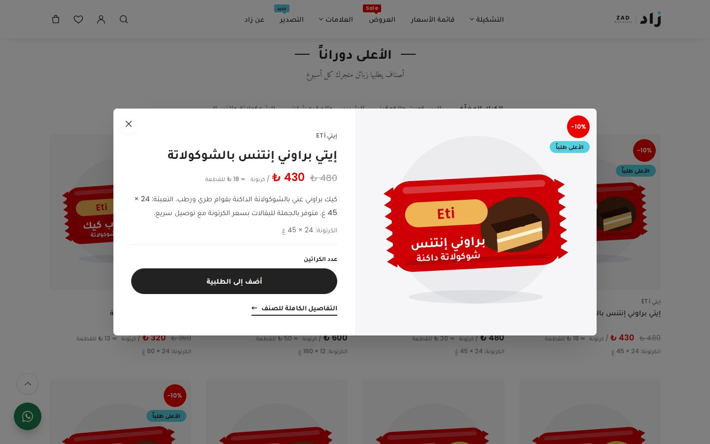
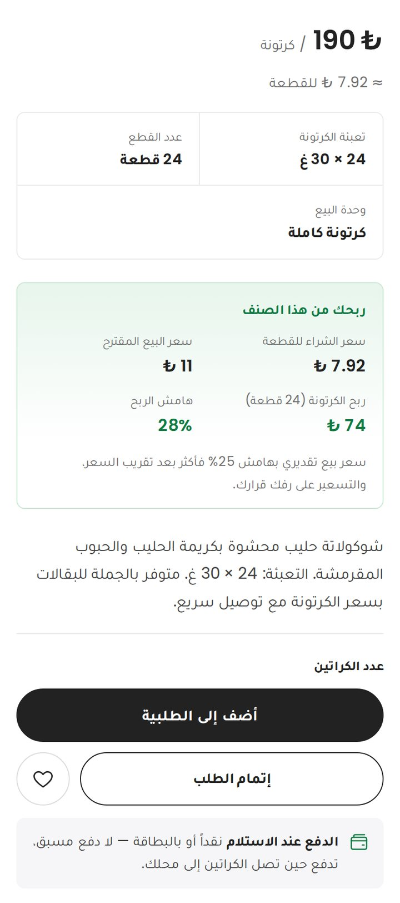
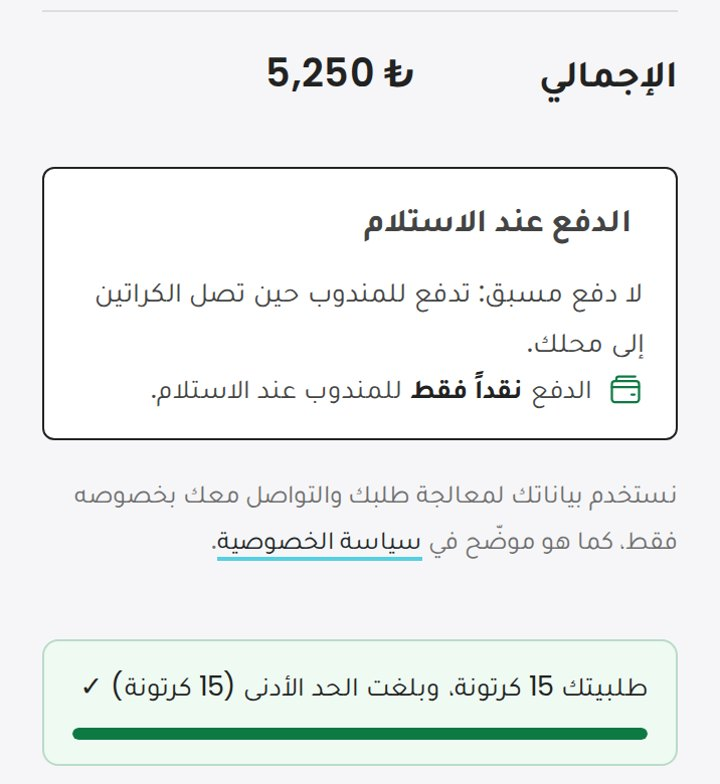
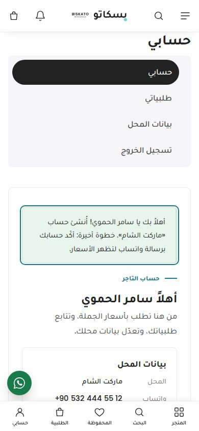
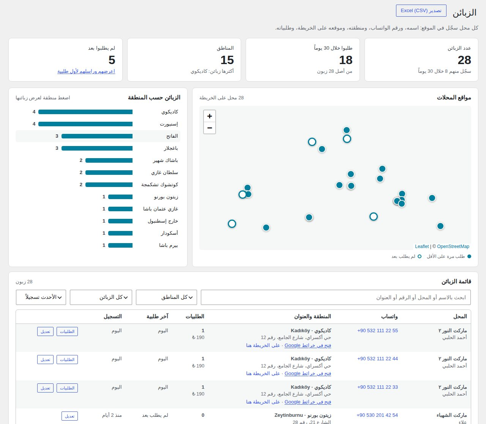
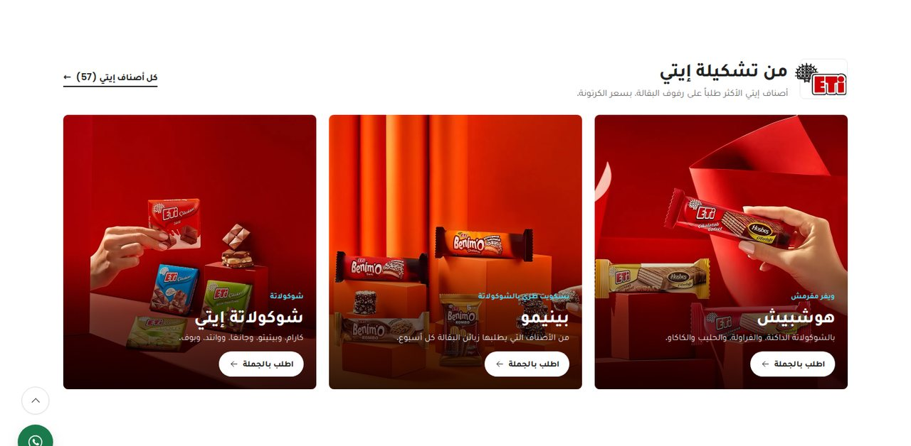
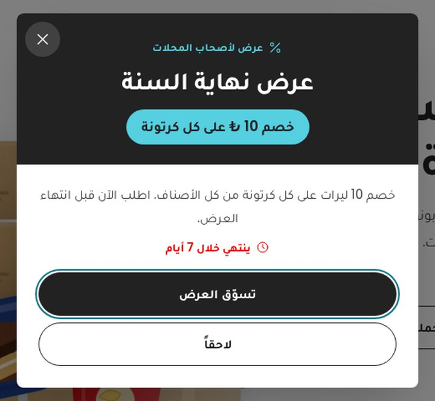
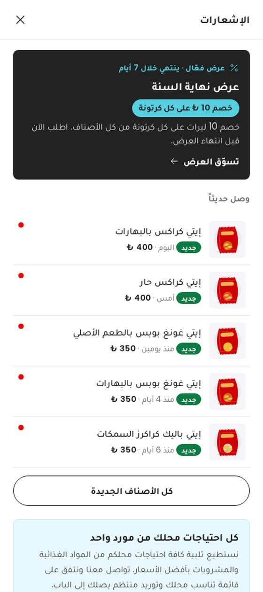
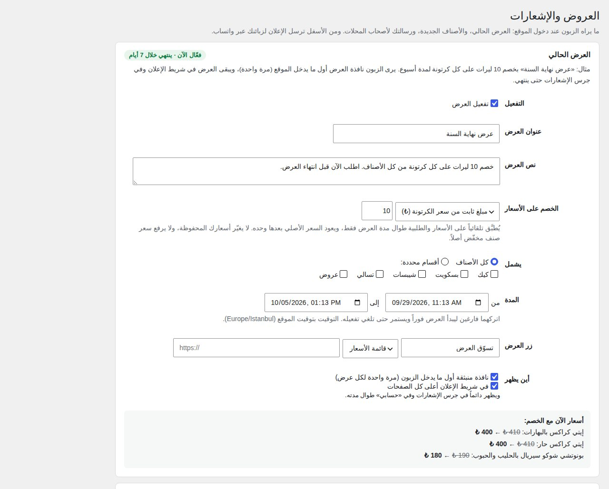

# زاد للتجارة — قالب جملة وتوزيع الحلويات والتسالي التركية (ووردبريس + ووكومرس)

قالب ووردبريس عربي بالكامل (RTL) لشركة **جملة وتوزيع**، لا لمحل حلويات. تصميمه مبني على طريقة قالب **Kalles** الشهير على شوبيفاي، ومكيّف لتجارة الجملة. الجمهور هو من يشتري ليبيع:

- السوبرماركت والسلاسل
- البقالات والميني ماركت
- الموزعون وتجار نصف الجملة
- المستوردون خارج تركيا

الموقع يبيع بالكرتونة والطبلية والحاوية، ويعرض سعر الكرتونة وسعر القطعة معاً. الطلب يتم من قائمة أسعار واحدة أو يُرسل إلى قسم المبيعات عبر واتساب.


| الرئيسية على الجوال | البحث | قائمة أسعار الجملة |
|---|---|---|
|  |  |  |



| ربح البقال في صفحة الصنف | الدفع عند الاستلام |
|---|---|
|  |  |

---

## الهوية البصرية

| العنصر | القيمة |
|---|---|
| الاسم | **زاد للتجارة** — ZAD · WHOLESALE |
| الشعار | كلمة «زاد» بخط عربي عريض، ونقطة الزاي بلون سماوي، ثم فاصل رفيع وكلمة ZAD WHOLESALE. الرمز وحده (أيقونة الموقع): مربع أسود بحواف مستديرة فيه حرف «ز» أبيض ونقطته سماوية. الملفات في `zad/assets/img/brand/`: نسخة للخلفيات الفاتحة وأخرى للداكنة، ونسخة مع السطر التعريفي، والرمز وحده |
| الألوان | أبيض `#FFFFFF` للخلفية · حبر `#222222` للنصوص والأزرار · رمادي ناعم `#F6F6F8` لخلفيات الصور والأقسام · خطوط `#EBEBEB` · سماوي `#56CFE1` للتفاعل والشارات، ونسخة داكنة منه `#13798A` للنصوص · أحمر `#EC0101` للخصومات فقط |
| الخطوط | **Tajawal** للعربي، و**Poppins** للاتيني والأرقام، و**Amiri** مع **Libre Baskerville** للعناوين الفرعية. كلها مستضافة داخل القالب بصيغة woff2 مع تقسيم الحروف، فلا يُحمّل أي خط من خارج الموقع |
| الأيقونات | أيقونات خطية رفيعة (سماكة 1.5) للأدوات فقط: القائمة والبحث والحساب والمحفوظات والطلبية والعرض السريع. الأقسام والخطوات بالصور |
| النبرة | لغة شركة توريد لا لغة متجر: «الطلبية» بدل «السلة»، و«قائمة أسعار الجملة»، و«افتح حساب جملة»، و«تحدث مع المبيعات» |

- تباين النصوص والأزرار يتجاوز معيار WCAG AA (4.5:1 أو أعلى).
- الأزرار كبسولية بارتفاع 40 إلى 52 بكسل، مريحة للمس على الجوال.

## ما الذي أُخذ من Kalles؟

صفحة العرض التجريبي لـ Kalles كانت محجوبة من بيئة العمل، فبُني التصميم من المعرفة بالقالب، لا بنسخ ملفاته:

| عنصر Kalles | في زاد |
|---|---|
| شريط إعلان أسود قابل للإغلاق | «أسعار جملة للحسابات التجارية…» مع رابط قائمة الأسعار |
| ترويسة بيضاء لاصقة: الشعار، القائمة في الوسط، الأيقونات في الطرف | مع شارات صغيرة فوق الروابط («Sale» على العروض و«جديد» على التصدير) |
| قائمة كبيرة (Mega menu) بالصور | الأقسام الخمسة بصورها وعدد أصنافها، وعمود للعلامات وروابط التجار |
| بحث في لوحة تنزل من الأعلى | البحث الذكي نفسه (علامات، أقسام، أصناف) مع الإضافة إلى الطلبية من النتائج |
| شرائح متحركة كبيرة | ثلاث شرائح: التوريد، والتصدير بالحاويات، وعروض الجملة. تتقلب تلقائياً، وتتوقف عند المرور، وتعمل بالسحب على الجوال |
| صف خدمات أسفل الواجهة | 24–48 ساعة · الدفع عند الاستلام · من كرتونة إلى حاوية · فاتورة نظامية |
| عناوين في الوسط بين خطين، وسطر فرعي بخط مزخرف | كل أقسام الرئيسية |
| بطاقات أقسام: صورة كبيرة وأربع صغيرة، وعلى كل صورة زر أبيض | الأقسام الخمسة |
| بطاقة منتج بلا إطار: شارة خصم دائرية حمراء، وقلب وعين تظهران عند المرور، وأزرار أسفل الصورة | «عرض سريع» + «أضف إلى الطلبية» الذي يتحول إلى عدّاد كراتين. على الجوال يظهر الزر دائماً تحت البطاقة |
| نافذة العرض السريع (Quick view) | الصورة، العلامة، السعر، الوصف، التعبئة، وعدّاد الكراتين |
| قائمة المفضلة (Wishlist) | «الأصناف المحفوظة»: تُحفظ في المتصفح وتفتح في درج جانبي |
| صفحة القسم: لافتة بعرض الشاشة، وشريط أدوات (تصفية، عدد الأعمدة، الترتيب) | التصفية حسب القسم والعلامة في درج جانبي، و2/3/4 أعمدة على الشاشة الكبيرة |
| لافتتان متجاورتان | التصدير بالحاويات، وطلب التوريد الخاص |
| درج قائمة بتبويبين على الجوال | «القائمة» و«الأقسام» |
| شريط تنقل سفلي على الجوال | المتجر، البحث، المحفوظة، الطلبية، حسابي |
| تذييل فاتح بخمسة أعمدة | الشركة، الأقسام، الروابط، والاشتراك في قائمة الأسعار الأسبوعية عبر واتساب |

## صور الموقع (Nano Banana Pro)

صُممت للموقع **20 صورة** بنموذج Nano Banana Pro على Higgsfield. الصور مخصصة للواجهة والأقسام والصفحات، وليست صور منتجات:

الصفحة الرئيسية لم تعد تستعمل هذه الصور، بل صوراً صُممت من صور إيتي (انظر «صور الصفحة الرئيسية» أدناه). تبقى هذه الصور للصفحات الأخرى:

| الصورة | مكانها |
|---|---|
| `seg-export` | صفحة التصدير |
| `sourcing` | صفحة طلب التوريد الخاص |
| `flatlay` | لافتة صفحة كل الأصناف |
| `seg-supermarket` | لافتة صفحتي أولكر وبونوتشي |
| `step-pick`، `step-deliver` | لافتة نتائج البحث، وصفحة التوريد والدفع |
| `about-team` | صفحتا «عن زاد» و«تواصل مع المبيعات» |
| `hero`، `hero-m`، `cat-*`، `seg-grocery`، `seg-distributor`، `step-order`، `quality`، `cta-docks`، `texture` | متاحة لصفحاتك الإضافية |

**تفعيل الصور على موقعك:** من **«المظهر ← صور الموقع»** اضغط **«جلب كل الصور»**. تنزّل الأداة كل صورة من مصدرها إلى استضافتك، وتحوّلها إلى WebP بمقاسين (للشاشات الكبيرة وللجوال)، ثم تستخدمها الواجهة تلقائياً. من سطر الأوامر:

```bash
wp zad site-images              # جلب كل الصور
wp zad site-images --only=hero  # صورة واحدة
wp zad site-images --reset      # الرجوع إلى الصور المضمّنة
```

إلى أن تُجلب الصور، يعرض القالب صوراً مؤقتة مضمّنة فيه (`zad/assets/img/site/`) بألوان فاتحة تناسب التصميم: كراتين وطبليات تحمل رمز زاد، وعبوات الأصناف، ورفوف، وحاوية، وقائمة الأسعار على شاشة جوال. كل الصور تُعرض بـ `srcset` وأبعاد ثابتة، وتُحمّل الصور البعيدة عن أول الشاشة بشكل مؤجّل.

## ماذا يحتوي القالب؟

- **الصفحة الرئيسية:**
  1. الشرائح المتحركة الثلاث، ثم صف الخدمات.
  2. «تسوّق حسب القسم» بالصور.
  3. «الأعلى دوراناً» بتبويبات حسب القسم.
  4. لافتتا التصدير والتوريد الخاص.
  5. «لمن نورّد»، ثم عروض الجملة، ثم «آلية العمل».
  6. شريط العلامات، ثم أسئلة تجار التجزئة، ثم نص السيو.
- **بطاقة صنف للتاجر:** العلامة، والاسم، وسعر الكرتونة مع سعر القطعة التقريبي، وتعبئة الكرتونة، والحفظ، والعرض السريع، وزر «أضف إلى الطلبية» الذي يتحول إلى عدّاد كراتين.
- **قائمة أسعار الجملة:**
  - كل الأصناف في صفحة واحدة مع تاريخ التحديث.
  - بحث فوري، وتصفية حسب القسم والعلامة والعروض والمحدد.
  - إجمالي تقديري، وإرسال الطلبية كاملة عبر واتساب، وطباعة القائمة.
- **بحث ذكي:** تظهر ثلاث مجموعات: العلامات والأقسام والأصناف، مع إضافة الصنف إلى الطلبية من النتائج مباشرة.
  - يفهم العربية والتركية، مثل «بسكريم» و`biskrem`.
  - يتجاهل اختلاف الهمزات والتاء المربوطة، فـ«اولكر» تجد «أولكر».
  - أي بحث في الموقع، حتى من رابط مباشر أو من محرك بحث، يُعرض كصفحة أصناف بالبطاقات والأسعار.
- **طلب توريد خاص:** إذا لم يجد التاجر صنفاً في القائمة، يرسل اسمه وعلامته وكميته، مع صورة اختيارية.
- **التصدير والجملة الدولية:**
  - التشكيلة المتاحة للتصدير، والمراحل الخمس من طلب عرض السعر حتى الميناء.
  - أحجام الشحنة: طبليات، أو حاوية 20 قدم، أو حاوية 40 قدم.
  - المستندات التي تُجهّز للشحنة، ونموذج طلب عرض سعر.
- **لوحة «طلبات العملاء»:** تجمع طلبات التوريد الخاص وطلبات التصدير والرسائل، مع حالة المتابعة وأزرار الاتصال وواتساب.
- **إتمام طلب مختصر:** اسم المسؤول، واسم المتجر أو الشركة، والجوال، والمدينة، والعنوان، ثم مكان التسليم (باب المحل أو على الرف). توصيل مجاني فقط بلا استلام من المستودع، والدفع عند الاستلام، ثم صفحة شكر بزر تأكيد عبر واتساب.
- **سعر البيع وهامش الربح:** كل صنف يعرض للبقال سعر بيع القطعة للمستهلك ونسبة ربحه، وفي صفحة الصنف صندوق «ربحك من هذا الصنف» فيه سعر الشراء للقطعة وسعر البيع وربح الكرتونة والهامش (التفاصيل أدناه).
- **حساب لكل زبون:** يسجّل صاحب المحل مرة واحدة باسمه، واسم المحل، ورقم الواتساب، والمنطقة، والعنوان، وموقع المحل على الخريطة. يدخل بعدها برقم الواتساب وكلمة مرور، ويرى في «حسابي» بيانات محله وآخر طلبية مع زر «اطلب نفس الطلبية مجدداً».
- **لوحة «الزبائن» لك:** في لوحة التحكم صفحة فيها عدد الزبائن، ومن طلب خلال 30 يوماً، ومن لم يطلب بعد، وتوزيعهم على المناطق، وخريطة بمواقع المحلات، وجدول بكل زبون مع رقم واتسابه وموقعه وطلبياته. يمكن تصديرها إلى Excel (التفاصيل أدناه).
- **الأصناف الجديدة والعروض والإشعارات:** قسم «أحدث الأصناف»، وشارة «جديد»، وجرس إشعارات يعلم الزبون بما وصل منذ زيارته الأخيرة. وعرض تجهّزه من لوحة التحكم (مثل «خصم 10 ليرات على كل كرتونة») يُطبَّق على الأسعار تلقائياً، ويظهر للزبون في نافذة بعد أن يتصفح قليلاً، لا فور دخوله (التفاصيل أدناه).
- **رسالة لأصحاب المحلات:** مثل «نستطيع تلبية كافة احتياجات محلكم من المواد الغذائية والمشروبات بأفضل الأسعار»، مع زر واتساب للاتفاق، في الرئيسية و«حسابي» وصفحة الشكر.
- **الدفع عند الاستلام:** يختار التاجر في صفحة الدفع كيف سيدفع للمندوب: نقداً، أو ببطاقة بنكية (جهاز POS)، أو بتحويل بنكي. يُحفظ اختياره مع الطلب ويظهر في صفحة الشكر والبريد ولوحة الطلبات ورسالة واتساب. وتظهر عبارة «الدفع عند الاستلام» تحت زر الشراء وفي درج الطلبية والسلة.
- **شريط الطلبية العائم:** يظهر فور إضافة أول صنف، ويعرض عدد الأصناف والكراتين والإجمالي، وكم بقي للوصول إلى الحد الأدنى للطلبية (إن حددته).
- **الأصناف المحفوظة كقائمة ثابتة:** يحفظ التاجر أصنافه المعتادة بالقلب، ثم يضيفها كلها إلى الطلبية بضغطة «أضف الكل إلى الطلبية».
- **صور المنتجات الحقيقية:** أداة تجلب صورة كل عبوة من صفحتها الرسمية أو من متاجر A101 وMigros (التفاصيل أدناه). المنتج الذي بلا صورة يُعرض برسم عبوة بلون علامته ونكهته.

## التثبيت خطوة بخطوة

1. ثبّت ووردبريس، ثم من «الإعدادات ← عام» اختر **لغة الموقع: العربية**.
2. ثبّت إضافة **WooCommerce** وفعّلها.
3. من «المظهر ← قوالب ← إضافة ← رفع قالب» ارفع [`dist/zad.zip`](dist/zad.zip) وفعّله.
4. افتح **«المظهر ← إعداد متجر زاد»** واضغط **«تشغيل الإعداد الكامل»**. هذا الزر:
   - يضبط العملة على الليرة التركية، والدفع عند الاستلام، وحقول الدفع المختصرة، ومنطقة التوريد.
   - ينشئ الأقسام والعلامات والصفحات والقوائم.
   - يضيف 132 صنفاً. يمكن تكرار الضغط بأمان، فلا يتكرر أي صنف.
5. افتح **«المظهر ← صور الموقع»** واضغط **«جلب كل الصور»**.
6. من **«المظهر ← تخصيص ← إعدادات متجر زاد»** أدخل:
   - رقم واتساب المبيعات بالصيغة الدولية، مثل `905xxxxxxxxx`.
   - الهاتف والبريد والعنوان وساعات العمل.
   - نص شريط الإعلان ونصوص الواجهة. يمكنك أيضاً رفع صورة واجهة خاصة بك.
   - إظهار الأسعار أو إخفاؤها، والحد الأدنى للطلبية.
   - إظهار سعر البيع وربح البقال، وهامش الربح الافتراضي (25% افتراضياً).
   - قبول البطاقة عند الاستلام (ألغِه إن لم يكن مع المندوب جهاز POS).
   - الطلب للزبائن المسجلين فقط (مفعّل)، وإخفاء الأسعار عن غير المسجلين (غير مفعّل).

إذا كان الموقع يعمل سابقاً بقالب «الشامي» أو «ماريا»، تُنقل بياناته تلقائياً عند التفعيل: حقول المنتجات، وخصائص الأقسام، والطلبات، والصفحات، والإعدادات.

المتطلبات: ووردبريس 6.4 أو أحدث، وWooCommerce 8.6 أو أحدث، وPHP 7.4 أو أحدث.
جُرّب القالب على ووردبريس 7.1.2 وWooCommerce 11.1.2 وPHP 8.4.

## كيف يطلب تاجر التجزئة؟

1. يفتح **قائمة أسعار الجملة** من جواله، أو يتصفح الأقسام ويضيف من البطاقات.
2. يحدد عدد الكراتين لكل صنف. يستطيع حفظ الأصناف التي يطلبها عادة بالقلب.
3. عند بلوغ الحد الأدنى (15 كرتونة من أي أصناف) يضغط **«إتمام الطلبية»** ويملأ خمسة حقول ويختار مكان التسليم، أو يضغط **«أرسل عبر واتساب»**. رسالة واتساب تحتوي كل الأصناف والكميات والإجمالي التقديري ومكان التسليم، كل صنف في سطر.

## الحد الأدنى للطلبية: 15 كرتونة

أقل طلبية **15 كرتونة** مجموعة من أي أصناف (يمكن أخذ كرتونة واحدة من الصنف). يُغيَّر الرقم من «تخصيص ← الطلبات والأسعار ← الحد الأدنى للطلبية (عدد الكراتين)»، و0 يلغيه.

- **قبل الإرسال:** يرى الزبون الحد الأدنى وما ينقصه في صفحة الصنف، وقائمة الأسعار، وشريط الطلبية العائم، ودرج الطلبية، وصفحة الطلبية (مع شريط تقدّم)، وفوق زر «تأكيد الطلبية».
- **تحت الحد:** يتحول زر «إتمام الطلب» إلى «أضف 12 كرتونة لإتمام الطلب». زر إرسال الطلبية عبر واتساب في السلة وقائمة الأسعار يتوقف مع رسالة توضيحية. ومن يفتح صفحة الدفع مباشرة يعود إلى الطلبية.
- **حماية الخادم:** لا تُنشأ طلبية تحت الحد حتى لو عُدّلت السلة من نافذة أخرى.
- حد اختياري إضافي بالمبلغ ما زال متاحاً: «الحد الأدنى لقيمة الطلب».

## التوصيل فقط (لا استلام من المستودع)

الموقع للطلب أونلاين فقط، والبضاعة تصل إلى المحل:

- **في السلة والدفع:** طريقة واحدة هي «توصيل مجاني إلى محلك». لا خيار «استلام من المستودع» ولا حاسبة شحن.
- **مكان التسليم:** في صفحة الدفع يختار صاحب المحل بين:
  - **عند باب المحل:** يسلّمه المندوب الكراتين عند الباب.
  - **ترتيبها على الرف:** يُدخل المندوب الكراتين ويرصّ الأصناف على الرفوف.
- **أين يظهر الاختيار:** في صفحة الشكر، والبريد، و«حسابي ← الطلبات»، وصفحة الطلب في لوحة التحكم، ورسالة واتساب. ويُحفظ لحساب الزبون فيُختار تلقائياً في طلبيته التالية.
- **المواقع القائمة:** عند تحديث القالب تُحذف طرق الاستلام من مناطق الشحن تلقائياً (مرة واحدة)، ويصبح اسم التوصيل «توصيل مجاني إلى محلك». ولا يمكن إضافة «استلام محلي» من إعدادات ووكومرس بعد ذلك.

## صور المنتجات الحقيقية

القالب يجلب صورة العبوة الحقيقية لكل منتج إلى متجرك، ويعمل ذلك من استضافتك.

روابط صفحات 120 منتجاً محفوظة مسبقاً في [`zad/inc/data/image-sources.php`](zad/inc/data/image-sources.php). لكل منتج صفحته الرسمية على etietieti.com إن وُجدت، ثم صفحته في متجري A101 وMigros.

1. افتح **«المنتجات ← الصور الرسمية»** واضغط **«البحث عن صور كل المنتجات»**.
2. راجع الجدول، وأزل علامة التحديد عن أي صورة لا تناسبك. لأي منتج بلا صورة، الصق رابط صفحته أو رابط الصورة نفسها.
3. اضغط **«استيراد الصور المحددة»**.

```bash
wp zad images --import               # كل المنتجات
wp zad images --import --skip-index  # الروابط المحفوظة فقط
```

الصور ملك الشركات المصنّعة. يُستحسن التأكد من موافقة المورد على استخدامها.

## تعديل الأسعار (مهم قبل الإطلاق)

> ⚠️ **الأسعار المضافة تقديرية**، وأعداد القطع والأوزان في الكرتونة تقريبية. عدّلها حسب فاتورة المورد قبل الإطلاق.

- **تعديل جماعي:**
  1. افتح [`products-ar.csv`](products-ar.csv) وعدّل عمودي `Regular price` (سعر الكرتونة) و`Sale price` (سعر العرض).
  2. من «المنتجات ← استيراد» ارفع الملف وفعّل «تحديث المنتجات الموجودة». المطابقة برمز SKU.
- **صنف جديد:** أضف الصنف واختر قسمه وعلامته، ثم املأ الحقول المخصصة:

  | الحقل | المعنى | مثال |
  |---|---|---|
  | `_zad_pack` | تعبئة الكرتونة | `24 × 45 غ` |
  | `_zad_units` | عدد القطع في الكرتونة | `24` |
  | `_zad_rrp` | سعر البيع المقترح للقطعة (سعر الرف للمستهلك) | `12.5` |
  | `_zad_brand` | العلامة | `eti` أو `ulker` أو `bonucci` |
  | `_zad_flavor` | النكهة | `chocolate` أو `banana` |

  الحقول الأربعة الأولى تظهر في صفحة تحرير المنتج ضمن «بيانات الجملة (قالب زاد)» في تبويب «عام».

- **إعادة توليد ملف CSV:** `wp eval-file wordpress-store/tools/export-csv.php wordpress-store/products-ar.csv`

## حسابات الزبائن ولوحة «الزبائن»

| حساب جديد على الجوال | لوحة «الزبائن» في لوحة التحكم |
|---|---|
|  |  |

**التسجيل (صفحة «حسابي»):** يطلب من صاحب المحل:

- الاسم، واسم المحل، ورقم الواتساب. الرقم هو اسم الدخول ولا يتكرر.
- المنطقة (مناطق إسطنبول الـ39، أو «خارج إسطنبول» مع اسم المدينة)، والعنوان بالتفصيل.
- موقع المحل على الخريطة (اختياري): بزر «موقعي الحالي»، أو بلمس مكان المحل على الخريطة، ويمكن سحب الدبوس لتدقيقه. يسرّع وصول المندوب، ومن تجاوزه يتصل به قسم المبيعات لتأكيد العنوان.
- كلمة مرور. البريد اختياري.

**الدخول:** برقم الواتساب بأي صيغة (`0532…` أو `+90 532…` أو `532…`) أو بالبريد. إن نسي الزبون كلمة المرور ولا بريد لحسابه، تضبط له كلمة جديدة من «المستخدمون ← تعديل».

**قبل الطلب:** عند «إتمام الطلب» يُحوَّل الزائر غير المسجل إلى التسجيل، وتبقى طلبيته محفوظة، ثم يعود إلى الدفع وبياناته معبّأة. في أعلى صفحة التسجيل زر «أرسل الطلبية عبر واتساب» لمن يستعجل، وإرسال الطلبية عبر واتساب يبقى متاحاً للجميع. لإلغاء هذا الشرط: «تخصيص ← الطلبات والأسعار ← الطلب للزبائن المسجلين فقط».

**«حسابي» للزبون:** بيانات المحل، وعدد طلبياته، وآخر طلبية مع «اطلب نفس الطلبية مجدداً»، و«بيانات المحل» لتعديل الرقم والمنطقة والموقع وكلمة المرور.

**لوحة «الزبائن» (في القائمة الجانبية للوحة التحكم):**

- أرقام سريعة: عدد الزبائن، ومن طلب خلال 30 يوماً، وعدد المناطق، ومن لم يطلب بعد (مع زر لعرضهم ومراسلتهم).
- الزبائن حسب المنطقة: اضغط منطقة لعرض زبائنها في الجدول وعلى الخريطة.
- خريطة المحلات: النقطة الممتلئة لمن طلب، والفارغة لمن لم يطلب بعد. اضغط نقطة لرؤية المحل ورابط واتسابه.
- جدول الزبائن: بحث بالاسم أو الرقم أو العنوان، وتصفية بالمنطقة والحالة، وترتيب بالأحدث أو بعدد الطلبيات أو المشتريات. لكل زبون زر واتساب برسالة ترحيب، ورابط موقعه على خرائط Google، وطلبياته.
- «تصدير Excel (CSV)»: كل الزبائن مع أرقامهم ومناطقهم وإحداثياتهم وطلبياتهم.
- في الصفحة الرئيسية للوحة التحكم ملخص «زبائن زاد»، وفي «المستخدمون» أعمدة المحل والواتساب والمنطقة، وفي صفحة كل طلب رابط واتساب الزبون وموقع محله.
- يصلك بريد عند تسجيل كل زبون جديد (على بريد الطلبات في الإعدادات).

> الخرائط من OpenStreetMap وتحتاج اتصالاً بالإنترنت. لا تحتاج مفتاح Google.

**خيار «إخفاء الأسعار عن غير المسجلين»:** يرى الزائر الأصناف وعبارة «سجّل دخولك لرؤية السعر» وزر «سجّل دخولك للطلب» بدل زر الإضافة، ويرى الزبون المسجل الأسعار والربح كاملة. لا يصل أي سعر إلى الزائر: لا في كود الصفحة، ولا في بيانات Google المنظّمة، ولا في واجهة ووكومرس البرمجية. يفيد لإخفاء أسعارك عن المنافسين، لكن الأسعار لا تظهر حينها في نتائج Google.

## شعار إيتي ولافتاتها



أُضيف شعار إيتي وثلاث صور من صورها الترويجية:

- **في الرئيسية:** قسم «من تشكيلة إيتي» فيه ثلاث لافتات، على الجوال تُسحب أفقياً:
  - هوشبيش: تفتح نتائج أصناف هوشبيش.
  - بينيمو: تفتح نتائج بينيمو.
  - شوكولاتة إيتي: تفتح صفحة إيتي على قسم الشوكولاتة.
- **صفحة إيتي:** الشعار أعلى الصفحة فوق صورة العلامة.
- **الشعار في أماكن أخرى:** بطاقة إيتي في صفحة «العلامات»، وشريط العلامات في الرئيسية (رمادي يتلوّن عند المرور)، وشريحة العلامة في صفحة كل صنف من أصناف إيتي.

**لإضافة شعار أو لافتات لعلامة أخرى (أولكر أو بونوتشي):**

1. ضع الشعار في `zad/assets/img/brands/`.
2. ضع الصور في `zad/assets/img/site/` بصيغة WebP، مع نسخة بنصف العرض ينتهي اسمها بـ `-sm`.
3. أضف `logo` و`hero` و`showcase` للعلامة في `zad_brands()` داخل `inc/helpers.php`، على غرار إيتي. يظهر قسمها في الرئيسية تلقائياً.

**رفع الجودة:**

- **الشعار:** كان المرسل 84 × 54 بكسل. صار الآن `eti.svg`، وهو شعار متّجه يبقى حاداً بأي حجم:
  - الحروف وإطارها مكبّرة بنموذج Real-ESRGAN، ثم محوّلة إلى خطوط متّجهة.
  - قرص الشمس مرسوم من بكسلات الأصل نفسها، لأن تفاصيله الدقيقة غير موجودة في الملف الصغير.
- **اللافتات:** صارت 1600 × 1740 بدل 800 × 870:
  - كُبّرت بنموذج Real-ESRGAN.
  - أُعيدت ألوانها وإضاءتها إلى ألوان الأصل، فالفرق أقل من نصف درجة لونية.
  - يأخذ الجوال والشاشات العادية نسخة 800، والشاشات عالية الدقة نسخة 1600.

> الشعار والصور ملك شركة إيتي، والتذييل يوضح أن «زاد» موزّع جملة مستقل. تأكد أن اتفاقك مع المورد يسمح باستخدامها في الموقع. إن حصلت من المورد على الشعار الرسمي بصيغة SVG، ضعه مكان `eti.svg` بالاسم نفسه ليطابق الأصل تماماً.

## صور الصفحة الرئيسية

| الكمبيوتر | الجوال |
|---|---|
|  |  |

**الفكرة: حيوية وفرح وحركة.**

- ألوان مشبعة مبهجة، وحلويات في لحظة حركة: كرتونة جملة تنفجر بالحلويات، وسلة تقفز منها الشوكولاتة وسط قصاصات ملونة، وسفينة حاويات ملونة في ميناء مشمس.
- في المشاهد الواقعية: أناس يبتسمون، مثل صاحب بقالة في إسطنبول، وفريق التحميل، والسائق عند باب المحل.
- كل الصور مولّدة من جديد بنموذج **Nano Banana Pro** على Higgsfield، وكل العبوات فيها بلا علامات تجارية ولا نصوص.
- جهة النص في كل شريحة لون داكن عميق يضمن وضوح النص الأبيض.

**مقاسات الواجهة:** صارت تتبع نسبة صورها، فلا تُقص الصورة:

- **الكمبيوتر:** 21:9، بين 480 بكسل و84% من ارتفاع الشاشة.
- **الجوال:** 9:16، حتى 88% من ارتفاع الشاشة، والنص في الأعلى.
- **الجهاز اللوحي عمودياً:** 16:10.

| الصورة | المشهد |
|---|---|
| `hero-eti-1` و`-m` | كرتونة جملة تنفجر بالحلويات على غروب مرجاني، والنص على بنفسجي داكن |
| `hero-eti-2` و`-m` | سفينة حاويات ملونة في ميناء فيروزي مشمس وحاوية تفيض بالحلويات، والنص على أزرق محيطي |
| `hero-eti-3` و`-m` | سلة تسوّق تفيض بالحلويات وسط قصاصات ملونة وتوهج وردي، والنص على بنفسجي توتي |
| `tile-snacks` | شوكولاتة وحلوى تنطلق من تاج شوكولاتة سائلة (برتقالي ووردي) |
| `tile-biscuits` | برج بسكويت وكوكيز مع دفقة حليب (سماوي فاتح) |
| `tile-cake` | كيك محشو وشرائط صوص شوكولاتة وحبيبات ملونة (وردي حلوى) |
| `tile-chips` | انفجار شيبس وكراكرز وفشار (أصفر ليموني) |
| `tile-offers` | كراتين جملة بشريط وردي تنفجر بالحلويات والقصاصات (بنفسجي) |
| `banner-sourcing` | عدسة مكبرة فوق جدار من الحلويات تبرز لوح شوكولاتة لامعاً (فيروزي) |
| `banner-export` | رافعة شوكية صفراء تُدخل طبلية ملونة إلى حاوية برتقالية (سماء زرقاء) |
| `stage-*` | صور واقعية مبهجة: مدير سوبرماركت في ممر الحلويات، وصاحب بقالة في إسطنبول، وفريق تحميل، وميناء حاويات، والطلب من الجوال، والتجهيز، والتسليم عند باب المحل |

**تفعيلها على موقعك:**

1. من **«المظهر ← صور الموقع»** اضغط **«جلب كل الصور»**. أو من سطر الأوامر:

   ```bash
   wp zad site-images
   ```

2. تُجلب الصور إلى استضافتك بأسمائها أعلاه، وتحل محل الصور المؤقتة تلقائياً.
3. يظهر تنبيه في لوحة التحكم كلما وُجدت صور لم تُجلب بعد، أو تغيّر مصدرها بتحديث القالب (فيُعاد جلبها بالضغط نفسه).

**قبل الجلب** تعرض الرئيسية تصاميم مؤقتة مضمّنة في القالب:

- شرائح وبطاقات صُممت من صور إيتي الثلاث.
- مسارح عرض بأيقونات Microsoft Fluent Emoji (رخصة MIT، وتفاصيلها في `zad/assets/img/site/CREDITS.txt`).

**لاستبدال أي صورة بصورة حقيقية:**

1. ضع الصورة بالاسم نفسه في `zad/assets/img/site/` بصيغة WebP، مع نسخة بنصف العرض ينتهي اسمها بـ `-sm`.
2. اضغط «الرجوع إلى الصور المضمّنة» لتلك الصورة، أو لا تجلبها أصلاً.

## الأصناف الجديدة والعروض والإشعارات

| نافذة العرض عند أول دخول | جرس الإشعارات |
|---|---|
|  |  |

كل شيء يُضبط من **«الزبائن ← العروض والإشعارات»** في لوحة التحكم:



### الأصناف الجديدة

كل صنف تضيفه من «المنتجات ← إضافة منتج» يصير «جديداً» تلقائياً مدة 21 يوماً (قابلة للتغيير):

- **على الصنف:** شارة «جديد» على بطاقته وفي قائمة الأسعار، مع فلتر «جديد» في قائمة الأسعار.
- **في الرئيسية:** قسم «أحدث الأصناف» يعرض الجديد أولاً، ومنه رابط إلى صفحة «الأصناف الجديدة» (`/shop/?zd_new=1`).
- **جرس الإشعارات في الترويسة:** عليه عدد ما لم يره الزبون، ويفتح قائمة بالأصناف الجديدة والعرض الحالي.
- **الزائر العائد:** تظهر له رسالة صغيرة «وصل 3 أصناف جديدة منذ زيارتك الأخيرة» مع زر «اعرضها».
- **الزبون المسجّل:** يرى «وصل حديثاً» في «حسابي». ما اطّلع عليه يُحفظ في حسابه، فلا يتكرر الإشعار على هاتفه وحاسوبه.

الأصناف الـ132 التي يضيفها الإعداد التلقائي لا تُعدّ «جديدة». لإعادة صنف قديم إلى الجديد (عند عودته للتوفر مثلاً)، غيّر «تاريخ النشر» في صفحة تحريره إلى اليوم.

### العرض الحالي

مثال: عرض نهاية السنة بخصم 10 ليرات على كل كرتونة لمدة أسبوع.

1. اكتب العنوان والنص.
2. اختر الخصم:
   - **مبلغ ثابت من سعر الكرتونة:** مثل 10 ₺.
   - **نسبة:** مثل 5%.
   - **بلا خصم:** إعلان فقط.
3. اختر إن كان يشمل كل الأصناف أو أقساماً محددة، وحدّد المدة.
4. اضغط «حفظ».

طوال مدة العرض:

- **الأسعار:** تنخفض تلقائياً في البطاقات والطلبية والدفع، مع السعر القديم مشطوباً وشارة «−10 ₺». بعد انتهاء المدة تعود الأسعار وحدها. لا تتغير أسعارك المحفوظة، ولا يرفع العرض سعر صنف مخفّض أصلاً.
- **النافذة المنبثقة:** تظهر مرة واحدة فقط، بعد 15 ثانية من التصفح أو بعد تمرير نصف الصفحة، لا فور الدخول. لا تظهر في صفحات الصنف والطلبية والدفع والحساب، ولا لمن ضغط رابط العرض في الشريط العلوي. إن غيّرت الخصم أو النص أو المدة، تظهر من جديد لكل الزبائن.
- **أماكن أخرى:** يظهر العرض في شريط الإعلان أعلى الصفحات، وفي الجرس، وفي «حسابي».

**أرسله لزبائنك عبر واتساب:** في أسفل الصفحة رسالة جاهزة للأصناف الجديدة أو للعرض، وقائمة بزبائنك.

- اضغط «إرسال» بجانب أي زبون: تُفتح محادثته والرسالة جاهزة باسمه.
- أو اضغط «نسخ الرسالة» وانشرها في قائمة بث أو حالة واتساب.

### رسالة لأصحاب المحلات

صندوق فيه عنوان ونص وزر، مثل «نستطيع تلبية كافة احتياجات محلكم من المواد الغذائية والمشروبات بأفضل الأسعار».

- **الزر:** يفتح واتساب برسالة جاهزة فيها اسم الزبون ومحله ومنطقته (إن كان مسجلاً).
- **الأماكن:** تختارها بنفسك: الرئيسية، و«حسابي»، وصفحة الشكر بعد الطلب، وأسفل جرس الإشعارات.

## سعر البيع وهامش الربح

البقال يسأل قبل أن يشتري: بكم أبيع القطعة؟ وكم أربح؟ لذلك يعرض كل صنف:

- **على البطاقة وفي قائمة الأسعار والبحث:** سعر بيع القطعة، مثل «بيع القطعة 24 ₺»، ونسبة الربح، مثل «ربحك 25%».
- **في صفحة الصنف:** سعر الشراء للقطعة، وسعر البيع المقترح، وربح الكرتونة، وهامش الربح.

طريقة الحساب:

1. سعر الشراء للقطعة = سعر الكرتونة (أو سعر العرض إن وُجد) ÷ عدد القطع.
2. سعر البيع:
   - إن كتبت «سعر البيع المقترح» للصنف (`_zad_rrp`)، يُعرض كما هو، مع عبارة «سعر البيع المعتاد للمستهلك في السوق».
   - إن تركته فارغاً، يُقدَّر من «هامش ربح البقال الافتراضي»، ثم يُقرَّب للأعلى إلى نصف ليرة (أو ليرة فوق 100 ₺)، مع عبارة «سعر بيع تقديري».
3. هامش الربح = (سعر البيع − سعر الشراء) ÷ سعر البيع، كما يحسبه البقال.

مثال: كرتونة 190 ₺ فيها 24 قطعة، فسعر القطعة 7.92 ₺. بهامش 25% يصبح سعر البيع 11 ₺ بعد التقريب، فيربح البقال 74 ₺ في الكرتونة (28%).

> 💡 **الأفضل أن تكتب سعر الرف الحقيقي** لكل صنف (المطبوع على العبوة أو المعتاد في بقالات إسطنبول)، لأن الرقم الحقيقي يُقنع التاجر أكثر من التقدير. لتعبئتها دفعة واحدة، أضف عموداً باسم `Meta: _zad_rrp` إلى ملف CSV ثم استورده مع «تحديث المنتجات الموجودة».

لا يظهر سعر البيع ولا الربح إذا أخفيت الأسعار، أو إذا لم يكن للصنف عدد قطع (مثل الباقات).

## السيو والاستهداف

الكلمات المستهدفة هي كلمات من يشتري ليبيع، لا كلمات المستهلك النهائي:

- «حلويات تركية بالجملة»
- «موزع بسكويت تركي»
- «كيك مغلّف بالجملة»
- «شيبس بالكرتونة»
- «تصدير حلويات تركية»
- «مورد سوبرماركت»

وتُكتب أسماء العلامات بالعربية والتركية معاً (إيتي / Eti).

- عناوين ووصف تلقائي لكل نوع صفحة، مثل «الكيك المغلّف بالجملة – توريد إيتي وأولكر وبونوتشي لتجار التجزئة» و«تصدير حلويات تركية بالجملة – حاويات مختلطة وشحن دولي».
- مسار تنقل صحيح في كل صفحة (الرئيسية ← كل الأصناف ← القسم).
- بيانات منظمة Schema.org:
  - `WholesaleStore`
  - `WebSite` مع مربع البحث
  - `BreadcrumbList`
  - `FAQPage` (أسئلة تجار التجزئة والمستوردين)
  - `Product`
- صورة مشاركة (Open Graph) بهوية زاد تظهر عند إرسال الرابط في واتساب.
- منع فهرسة الطلبية والدفع والبحث والحساب.
- إذا ثبّتّ Yoast أو Rank Math يتنحّى القالب تلقائياً عن العناوين والوصف.

## ملاحظات مهمة

- **العلامات التجارية:** هوية زاد مستقلة تماماً. لا تُستخدم شعارات الشركات، وتظهر أسماؤها نصاً فقط. في التذييل وصفحة «عن زاد» توضيح أن زاد موزّع جملة مستقل، وأن العلامات ملك أصحابها.
- **Kalles:** التصميم مستوحى من أسلوب القالب وطريقة تنظيمه، ولا يحتوي أي ملف أو صورة أو كود منه.
- **مصدر قائمة المنتجات:** مواقع الشركات وقوائم المتاجر التركية العامة، مترجمة إلى العربية. راجعها حسب مخزونك.

## بنية الملفات

```
wordpress-store/
├── zad/                          ← القالب
│   ├── inc/
│   │   ├── setup.php             ← التهيئة والأنماط والخطوط ونقل بيانات القوالب السابقة
│   │   ├── helpers.php           ← الإعدادات، الأقسام، شرائح العملاء، الشعار، صور الموقع، عناوين الأقسام
│   │   ├── site-images.php       ← جلب صور الموقع وتحويلها إلى WebP
│   │   ├── search.php            ← البحث الذكي وفلاتر الأرشيف
│   │   ├── customizer.php        ← إعدادات المتجر
│   │   ├── woocommerce.php       ← البطاقة، شريط أدوات الأرشيف، صفحة الصنف، الطلبية، الدفع
│   │   ├── quick-order.php       ← قائمة الأسعار ومزامنة الطلبية
│   │   ├── profit.php            ← سعر البيع المقترح وهامش ربح البقال، وحقول الجملة في تحرير المنتج
│   │   ├── cod.php               ← الدفع عند الاستلام: نقداً أو بطاقة أو تحويل، وإبرازه في المتجر
│   │   ├── delivery.php          ← التوصيل فقط: إلغاء الاستلام، واختيار التسليم عند باب المحل أو على الرف
│   │   ├── customers.php         ← حسابات الزبائن: التسجيل بالواتساب والموقع، الدخول بالرقم، «حسابي»، شرط الحساب قبل الطلب
│   │   ├── customers-admin.php   ← لوحة «الزبائن»: الأرقام، المناطق، الخريطة، الجدول، تصدير CSV
│   │   ├── engage.php            ← الأصناف الجديدة، العرض الحالي (خصم تلقائي ونافذة وشريط)، الجرس، رسالة أصحاب المحلات
│   │   ├── engage-admin.php      ← «العروض والإشعارات»: الإعدادات ومساعد الإرسال عبر واتساب
│   │   ├── requests.php          ← النماذج ولوحة «طلبات العملاء»
│   │   ├── seo.php               ← العناوين، الوصف، مسار التنقل، Schema، الأسئلة الشائعة
│   │   ├── product-art.php       ← رسومات العبوات SVG
│   │   ├── seeder.php            ← الإعداد بضغطة واحدة
│   │   ├── image-import.php      ← جلب صور المنتجات الحقيقية
│   │   ├── i18n-fallback.php     ← ترجمة احتياطية لنصوص ووكومرس
│   │   └── data/                 ← الكتالوج، روابط الصور، نصوص الأقسام، محتوى الصفحات
│   ├── page-templates/           ← قائمة الأسعار، العلامات، التوريد الخاص، التصدير، التواصل
│   ├── template-parts/home/      ← الشرائح، الخدمات، الأقسام، أحدث الأصناف، الأعلى دوراناً، لافتات العلامات، اللافتات، لمن نورّد، العروض، رسالة أصحاب المحلات، آلية العمل، العلامات
│   ├── template-parts/shop/      ← لافتة الأرشيف ودرج التصفية
│   ├── woocommerce/content-product.php
│   └── assets/                   ← css، js، fonts، img (brand + brands + site)، vendor/leaflet
├── dist/zad.zip                  ← ملف الرفع إلى ووردبريس
├── products-ar.csv               ← الأصناف بصيغة مستورد ووكومرس
├── tools/export-csv.php          ← توليد ملف CSV
├── screenshots/                  ← لقطات الشاشة
└── build-zip.sh                  ← إعادة بناء dist/zad.zip
```

أوامر WP-CLI:

```bash
wp zad seed                  # الإعداد الكامل
wp zad seed --mode=products  # إضافة الأصناف الناقصة فقط
wp zad seed --mode=pages     # الصفحات والقوائم فقط
wp zad site-images           # جلب صور الموقع
wp zad images --import       # جلب صور المنتجات واستيرادها
```

## ما الذي جرى اختباره؟

جرى الاختبار على موقع ووردبريس حقيقي، بمتصفح Chromium آلي على شاشة جوال (390 بكسل) وشاشة كمبيوتر (1440 بكسل):

- **الطلب من الرئيسية:** إضافة صنف من البطاقة وزيادة الكمية، ثم تحديث عدّاد الطلبية.
- **أدوات Kalles:** القائمة الكبيرة والقائمة المنسدلة، ولوحة البحث، والعرض السريع، والحفظ، ودرج الطلبية، ودرج التصفية، وتبديل عدد الأعمدة، ودرج الجوال بتبويبيه.
- **البحث الذكي:** بالعربية والتركية، مع الإضافة إلى الطلبية من النتائج.
- **قائمة الأسعار:** الفلاتر، والإجمالي، ورسالة واتساب، ثم إتمام الطلبية.
- **صفحة الصنف والدفع:** عدّاد الكراتين وشريط الإضافة الثابت على الجوال، ثم مكان التسليم (باب المحل / الرف) والدفع عند الاستلام، ثم صفحة الشكر مع التأكيد عبر واتساب.
- **رسائل واتساب:** كل صنف في سطر مستقل في رسائل السلة وصفحة الصنف وصفحة الشكر والاشتراك.
- **وضع «الأسعار للأعضاء فقط»:** لا سعر في كود الصفحات ولا في البيانات المنظّمة ولا في Store API، ولا إضافة إلى الطلبية قبل الدخول.
- **مزامنة الطلبية:** تُرفض الطلبات القادمة من مواقع أخرى (CSRF).
- **الحد الأدنى 15 كرتونة:** ظاهر في كل مراحل الطلب، والإتمام ممنوع تحته (من الأزرار، ومن فتح صفحة الدفع مباشرة، ومن تأكيد الطلب بعد تخفيض السلة).
- **الوصول:** صفر مخالفات WCAG 2.1 AA في الصفحات الرئيسية والدفع، والتنقل بلوحة المفاتيح في الأدراج والنوافذ.
- **شعار إيتي ولافتاتها:**
  - تعمل روابط اللافتات الثلاث: 3 أصناف هوشبيش، وبينيمو، و12 صنف شوكولاتة من إيتي.
  - لا ملاحظات إمكانية وصول (axe) ولا تمرير أفقي في الرئيسية وصفحة إيتي و«العلامات» وصفحة الصنف، على الجوال والكمبيوتر.
- **العروض والإشعارات:**
  - عرض «خصم 10 ₺ على كل كرتونة»:
    - تظهر نافذته لزائر جديد مرة واحدة فقط، وتُغلق بزر Esc.
    - يظهر في شريط الإعلان.
    - ينخفض السعر من 190 إلى 180 ₺ في الصنف والدفع والطلب المسجّل.
    - لا يتغير صنف مخفّض أصلاً إلى سعر أعلى.
  - تعديل الخصم من لوحة التحكم يُظهر النافذة من جديد لمن رآها.
  - خمسة أصناف جديدة:
    - تظهر أولاً في «أحدث الأصناف» وعليها شارة «جديد».
    - تظهر في الجرس ويصفر عدّاده بعد فتحه.
    - الزائر العائد تصله رسالة «وصل 3 أصناف جديدة»، ومنها إلى صفحة «الأصناف الجديدة».
    - فلتر «جديد» في قائمة الأسعار يعرضها.
  - الزبون المسجّل: ما اطّلع عليه على جهاز لا يُعاد إشعاره على جهاز آخر.
  - رسالة أصحاب المحلات تظهر في الرئيسية و«حسابي» وصفحة الشكر، وزرها يفتح واتساب باسم المحل ومنطقته.
  - فحص إمكانية الوصول (axe) للنافذة والجرس والرسالة المنبثقة وصفحة الأصناف الجديدة ولوحة التحكم دون أي ملاحظة.
- **الحسابات ولوحة «الزبائن»:**
  - زائر يضيف صنفاً ثم يطلب: يُحوَّل إلى التسجيل وطلبيته محفوظة، ثم يعود إلى الدفع وبياناته معبّأة.
  - يُمنع التسجيل دون موقع على الخريطة (في المتصفح وفي الخادم)، ويُرفض الرقم المكرر، وتبقى البيانات المكتوبة عند الخطأ.
  - الدخول برقم مكتوب بصيغة مختلفة، ورسالة عربية واضحة لكلمة المرور الخاطئة، وتعديل المنطقة والموقع من «بيانات المحل».
  - لوحة «الزبائن» مع 27 زبوناً تجريبياً: الأرقام، والتصفية بالمنطقة والحالة، والبحث، والترتيب، والخريطة، وتصدير CSV.
  - فحص إمكانية الوصول (axe) لصفحات الحساب ولوحة «الزبائن» دون أي ملاحظة.
- **الربح والدفع عند الاستلام:**
  - سعر البيع والهامش على 128 صنفاً، في البطاقة والعرض السريع وقائمة الأسعار والبحث وصفحة الصنف.
  - حفظ سعر البيع من لوحة التحكم، بما فيه الفاصلة العشرية التركية (12,5).
  - طلب كامل باختيار «بطاقة بنكية»: يبقى الاختيار بعد تحديث صفحة الدفع، ويُحفظ مع الطلب، ويظهر في صفحة الشكر ولوحة الطلبات ورسالة واتساب.
  - يختفي الربح في وضع «السعر عند الطلب»، ويختفي خيار البطاقة إذا ألغيته.
- **النماذج:**
  - طلب التوريد الخاص وطلب التصدير يُرسلان برقم مرجع.
  - يُرفض الإرسال الآلي السريع.
- **العرض:** لا يوجد تمرير أفقي، ولا أخطاء PHP أو JavaScript، في 19 صفحة على ثلاثة مقاسات (390 و768 و1440 بكسل)، باللمس وبالفأرة.
- **تدقيق شامل:** زحف على 268 صفحة دون روابط معطلة أو أخطاء، وفحص إمكانية الوصول (axe) دون أي ملاحظة، ومراجعة أمنية للنماذج والمزامنة وأدوات لوحة التحكم، واختبار وضع «السعر عند الطلب» والحد الأدنى والترحيل من «الشامي».
