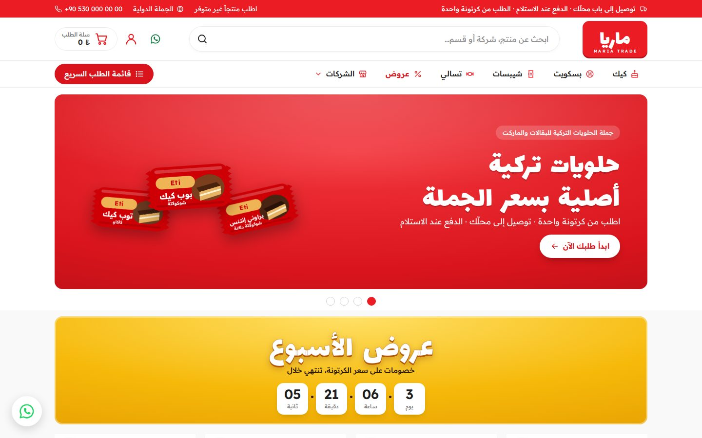
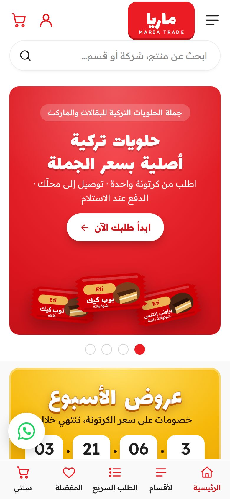
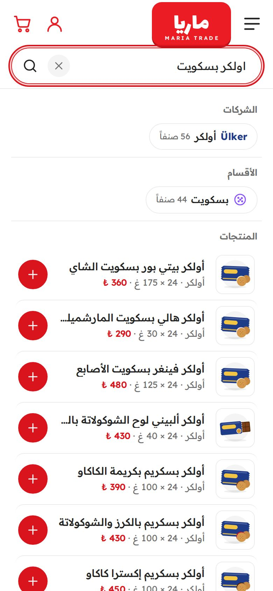
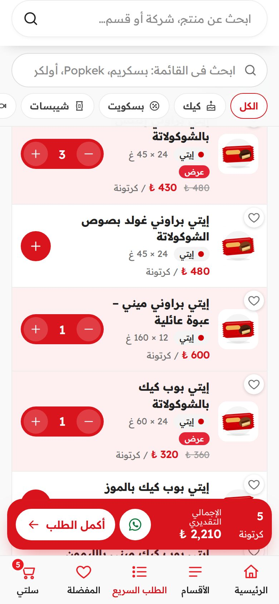

# «ماريا» — منصّة جملة الحلويات والتسالي للبقالات (ووردبريس + ووكومرس)

قالب ووردبريس عربي بالكامل (RTL) لمتجر جملة يبيع **الكيك والبسكويت والشيبسات والتسالي** التركية لأصحاب البقالات والماركت.
الفكرة: ترسل رابط موقعك لصاحب البقالة، فيفتحه من جواله، ويبحث عن الأصناف أو يختار القسم أو الشركة، ويحدد عدد الكراتين، ويرسل الطلب خلال دقيقة.



| الرئيسية على الجوال | البحث الذكي | قائمة الطلب السريع |
|---|---|---|
|  |  |  |

---

## الهوية البصرية

| العنصر | القيمة |
|---|---|
| الاسم | **ماريا** — MARIA TRADE |
| الشعار | شارة حمراء بكلمة «ماريا» بخط **Lalezar** الأبيض العريض، وتحتها MARIA TRADE. رمز الأيقونة حلوى مغلّفة بيضاء على مربع أحمر |
| الألوان | أحمر `#EB1C24` للشعار والنقاط والعناصر الكبيرة، و`#D9141C` للأزرار والأسعار والروابط (أغمق قليلاً لتباين أوضح) · بنفسجي `#500878` لشارات الباقات · برتقالي `#FF7B19` لشارة «مطلوب» · نص `#212121` |
| الخلفية | رمادي فاتح جداً `#F9F9F9` للأقسام، وأبيض لصور المنتجات والأقسام المميزة |
| الخطوط | **Readex Pro** للعربية واللاتينية معاً (خط هندسي حديث)، و**Lalezar** للشعار والعناوين الإعلانية الكبيرة. من Google Fonts ومستضافة داخل القالب |
| طريقة العرض | بنرات متحركة بنقاط تنقل، لافتة «عروض الأسبوع» الصفراء بعدّاد تنازلي، مربعات أقسام ملوّنة، شرائط منتجات أفقية (بطاقتان على الجوال)، بطاقة منتج بيضاء فيها المفضلة والعرض السريع، والشركة بالأحمر، والسعر قبل وبعد الخصم، وشارة الخصم، وزر «أضف إلى السلة» بإطار أحمر |

- تباين نصوص الأسعار والأزرار يتجاوز معيار WCAG AA (4.5:1 أو أعلى).
- كل الأزرار والعناصر القابلة للضغط بارتفاع 42 إلى 56 بكسل، مريحة للمس على الجوال.

## ماذا يحتوي القالب؟

- **الطلب من الصفحة الرئيسية:** بعد البنرات مباشرة شريط «عروض الأسبوع»، ثم مربعات الأقسام والشركات، وتبويبا «الأكثر طلباً» و«باقات موفّرة»، و«الأكثر مبيعاً» حسب القسم. كل بطاقة فيها زر «أضف إلى السلة» يتحول إلى عدّاد كراتين.
- **بنرات قابلة للتعديل:** من «المظهر ← تخصيص ← إعدادات متجر ماريا ← بنرات الرئيسية» ارفع حتى 3 صور بروابطها، وإن تركتها فارغة تظهر بنرات جاهزة تُولّد من منتجاتك.
- **المفضلة:** زر القلب في كل بطاقة وفي قائمة الطلب السريع يحفظ الصنف في متصفح الزبون، وزر «المفضلة» في الشريط السفلي يفتح قائمة الطلب السريع على أصنافه المفضلة لإعادة الطلب بسرعة.
- **بحث ذكي:** من شريط البحث تظهر ثلاث مجموعات: **الشركات** و**الأقسام** و**المنتجات**، وفي كل منتج زر + للإضافة إلى السلة من نتائج البحث مباشرة.
  - يفهم الاسم العربي والتركي، مثل «بسكريم» و`biskrem` و`ülker biskrem`.
  - يتجاهل اختلاف الهمزات والتاء المربوطة، فـ«اولكر» تجد «أولكر» و«شوكولاته» تجد «شوكولاتة».
  - إذا لم تطابق كل الكلمات يعرض الأقرب، فـ«كراكرز حار» تجد «كراكس حار».
  - على الجوال تُفتح النتائج بملء الشاشة، مع اقتراحات بحث شائعة قبل الكتابة.
- **تصفّح حسب الشركة أو القسم:**
  - صفحة «الشركات» تعرض كل شركة وعدد منتجاتها وأقسامها.
  - في كل قسم شرائح لتصفية النتائج حسب الشركة، وفي كل شركة شرائح حسب القسم، مع عدد المنتجات في كل شريحة.
  - أي علامة تجارية تضيفها من «المنتجات ← العلامات» تظهر تلقائياً في الدليل والبحث.
- **شريط الطلب العائم:** يظهر أسفل الشاشة فور إضافة أول صنف، وفيه عدد الأصناف والكراتين والإجمالي وزر «أكمل الطلب».
- **مزامنة فورية للسلة:** أي ضغطة + أو − في أي مكان تُحفظ مباشرة دون إعادة تحميل الصفحة.
- **قائمة الطلب السريع:** كل المنتجات في صفحة واحدة، مع بحث فوري وتصفية حسب القسم والشركة والعروض، ورسالة واتساب جاهزة بكل الأصناف، وطباعة قائمة الأسعار.
- **دفع بلا تعقيد:** الاسم، اسم البقالة، الجوال، المدينة، العنوان. البريد اختياري، والدفع عند الاستلام، ولا خانة كوبونات.
- **صفحة «اطلب منتجاً غير متوفر»:** يطلب فيها صاحب البقالة أي منتج، حتى من خارج الحلويات.
- **صفحة «الجملة الدولية والتصدير»:** نموذج عرض سعر بحاويات 20 أو 40 قدم أو طبليات مختلطة.
- **لوحة «طلبات العملاء»:** تجمع الطلبات الخاصة وطلبات التصدير والرسائل، مع حالة المتابعة وأزرار واتساب والاتصال.
- **صور المنتجات الحقيقية:** روابط صفحات 120 منتجاً محفوظة في القالب، وأداة تنزّل الصور بضغطة واحدة (التفاصيل أدناه). أي منتج بلا صورة يظهر برسم عبوة هادئ بلون شركته ونكهته.
- **جوال مثل التطبيقات:** شريط تنقل سفلي، وأدراج للقائمة والسلة، وترويسة يبقى فيها البحث والسلة ظاهرين عند التمرير.
- **سيو عربي متكامل:** تفاصيله في قسم السيو أدناه.

## التثبيت خطوة بخطوة

1. ثبّت ووردبريس، ثم من «الإعدادات ← عام» اختر **لغة الموقع: العربية**. هذا يحمّل ترجمة ووكومرس الكاملة.
2. ثبّت إضافة **WooCommerce** وفعّلها.
3. من «المظهر ← قوالب ← إضافة ← رفع قالب» ارفع الملف [`dist/maria.zip`](dist/maria.zip) ثم فعّله.
4. افتح **«المظهر ← إعداد متجر ماريا»** واضغط **«تشغيل الإعداد الكامل»**. هذا الزر:
   - يضبط العملة على الليرة التركية، والدفع عند الاستلام، وحقول الدفع المختصرة، ومنطقة شحن تركيا.
   - ينشئ الأقسام الخمسة والشركات الثلاث وكل الصفحات، ومنها صفحة «الشركات»، والقوائم.
   - يضيف المنتجات الـ 132. يمكن تكرار الزر بأمان، فلا يكرر أي منتج.
5. من **«المظهر ← تخصيص ← إعدادات متجر ماريا»** أدخل:
   - **رقم واتساب** بالصيغة الدولية، مثل `905xxxxxxxxx`. بدونه تختفي أزرار واتساب.
   - الهاتف والبريد والعنوان وساعات العمل.
   - نص شريط الإعلان، وعنوان الصفحة الرئيسية، وخيار إظهار الأسعار أو إخفائها، والحد الأدنى للطلب.
6. شعار «ماريا» بخط الرقعة جاهز افتراضياً ويأخذ اسمه من «اسم الموقع». يمكنك رفع شعارك كصورة من «المظهر ← تخصيص ← هوية الموقع».

المتطلبات: ووردبريس 6.4 أو أحدث، وWooCommerce 8.6 أو أحدث، وPHP 7.4 أو أحدث.
جُرّب القالب فعلياً على ووردبريس 7.1.2 وWooCommerce 11.1.2 وPHP 8.4.

## كيف يطلب صاحب البقالة؟

1. يفتح رابط موقعك من جواله.
2. يبحث باسم المنتج أو الشركة، أو يختار القسم، ويضغط **+** على كل صنف ويحدد عدد الكراتين.
3. يضغط **«أكمل الطلب»** من الشريط العائم، فيملأ 5 حقول فقط ويؤكد. أو يرسل الطلب من قائمة الطلب السريع عبر واتساب برسالة فيها كل الأصناف والكميات والإجمالي.

في الصفحة الرئيسية مربع **«شارك رابط المتجر»** لنسخ الرابط أو إرساله عبر واتساب إلى أصحاب البقالات.

## صور المنتجات الحقيقية

يضم القالب أداة تجلب صورة العبوة الحقيقية لكل منتج مباشرة إلى متجرك. تعمل الأداة من استضافتك، ولا تحتاج رفع أي صورة يدوياً.

**روابط المصدر جاهزة:** بحثنا عن كل منتج باسمه وحفظنا رابط صفحته في الملف [`maria/inc/data/image-sources.php`](maria/inc/data/image-sources.php). عدد المنتجات التي لها روابط محفوظة 120 من أصل 128 منتجاً حقيقياً. لكل منتج صفحته الرسمية على etietieti.com أولاً إن وُجدت، ثم صفحته في متجري **A101** و**Migros**. تجرّب الأداة الروابط بالترتيب وتأخذ الصورة من أول صفحة تعمل. المنتجات الثمانية الباقية من بونوتشي، وتبحث عنها الأداة في موقع bonuccisweet.com.

1. من لوحة التحكم افتح **«المنتجات ← الصور الرسمية»**.
2. اضغط **«البحث عن صور كل المنتجات»**. تستغرق العملية بضع دقائق.
3. راجع الجدول. أمام كل منتج صورته ورابط الصفحة التي أُخذت منها. أزل علامة التحديد عن أي صورة لا تناسبك.
4. لأي منتج بلا صورة، الصق رابط صفحته أو رابط الصورة نفسها في خانته واضغط «جلب».
5. اضغط **«استيراد الصور المحددة»**. تُنزَّل الصور إلى مكتبة الوسائط وتصبح الصورة الرئيسية لكل منتج.

لتشغيل الأداة كاملة من سطر الأوامر دون انتظار المتصفح:

```bash
wp maria images --import               # كل المنتجات
wp maria images --import --skip-index  # الروابط المحفوظة فقط، دون فهرسة المواقع الرسمية
wp maria images --brand=eti            # بحث فقط لشركة واحدة دون استيراد
```

ملاحظات:
- إن حذف المتجر صفحة المنتج وحوّلها إلى صفحته الرئيسية، تتجاوزها الأداة إلى الرابط التالي. كما تستبعد شعار المتجر، فلا يأخذ أي منتج صورة الشعار.
- لإضافة رابط أو تصحيحه لمنتج، عدّل الملف `image-sources.php` (المفتاح هو رمز SKU)، أو الصق الرابط يدوياً في الأداة.
- الصور ملك الشركات المصنّعة. استخدامها شائع لدى الموزعين، لكن يُستحسن التأكد من موافقة المورد.

## تعديل الأسعار بالجملة (مهم قبل الإطلاق)

> ⚠️ **الأسعار المضافة تقديرية**، وأعداد القطع والأوزان في الكرتونة تقريبية. عدّلها حسب فاتورة المورد قبل الإطلاق.

- **طريقة سريعة:** افتح [`products-ar.csv`](products-ar.csv) في Excel أو Google Sheets وعدّل عمودي `Regular price` (سعر الكرتونة) و`Sale price` (سعر العرض، اتركه فارغاً إن لم يوجد عرض). ثم من «المنتجات ← استيراد» ارفع الملف وفعّل **«تحديث المنتجات الموجودة»**. المطابقة تتم برمز SKU.
- **منتج واحد:** عدّله من «المنتجات» كالمعتاد.
- **منتج جديد:** أضفه من «المنتجات ← إضافة جديد». اختر القسم والعلامة، ويُستحسن ملء الحقول المخصصة:

  | الحقل | المعنى | مثال |
  |---|---|---|
  | `_maria_pack` | التعبئة | `24 × 45 غ` |
  | `_maria_units` | عدد القطع في الكرتونة | `24` |
  | `_maria_brand` | الشركة | `eti` أو `ulker` أو `bonucci` |
  | `_maria_flavor` | النكهة | `chocolate` أو `banana` وغيرها |

- **إعادة توليد ملف CSV** من الكتالوج:
  ```bash
  wp eval-file wordpress-store/tools/export-csv.php wordpress-store/products-ar.csv
  ```

## السيو والكلمات المفتاحية

- عناوين ذكية لكل نوع صفحة، مثل «كيك بالجملة للبقالات والماركت – إيتي وأولكر وبونوتشي» و«… بالجملة» لكل منتج.
- وصف تعريفي تلقائي لكل صفحة ومنتج وقسم، يتضمن الاسم العربي والتركي والتعبئة والمدينة.
- بيانات منظمة (Schema.org):
  - `WholesaleStore` للمتجر.
  - `WebSite` مع مربع البحث.
  - `BreadcrumbList` لمسار التنقل.
  - `FAQPage` للأسئلة الشائعة.
  - `Product` مع العلامة التجارية، عبر ووكومرس.
- Open Graph وTwitter Cards، مع صورة مشاركة بهوية ماريا تظهر عند إرسال الرابط في واتساب.
- نص سيو طويل أسفل كل قسم، وأوصاف منتجات تذكر الإملاءات الشائعة، مثل «إيتي» و«ايتي» و«Eti».
- منع فهرسة صفحات السلة والدفع والبحث والحساب، وإزالة خريطة المستخدمين من خريطة الموقع.
- إذا ثبّتّ Yoast أو Rank Math يتنحّى القالب تلقائياً عن العناوين والوصف، ويُبقي على بيانات المتجر والأسئلة الشائعة.

## ملاحظات مهمة

- **مصدر قائمة المنتجات:** جُمعت خطوط المنتجات وأسماؤها من مواقع الشركات وقوائم المتاجر التركية العامة، ثم تُرجمت للعربية. راجع القائمة وأضف أو احذف ما يناسب مخزونك.
- **العلامات التجارية:** هوية ماريا مستقلة تماماً. شعارات الشركات لا تُستخدم، وأسماؤها تظهر نصاً فقط. في التذييل وصفحة «من نحن» توضيح أن المتجر موزّع مستقل وأن العلامات مملوكة لأصحابها.

## بنية الملفات

```
wordpress-store/
├── maria/                        ← القالب
│   ├── inc/
│   │   ├── setup.php             ← التهيئة والأنماط والخطوط وأيقونة الموقع
│   │   ├── search.php            ← البحث الذكي (منتجات + شركات + أقسام) وفلاتر الأرشيف
│   │   ├── customizer.php        ← إعدادات المتجر
│   │   ├── woocommerce.php       ← البطاقة، صفحة المنتج، السلة، الدفع، مزامنة العروض
│   │   ├── quick-order.php       ← بيانات الطلب السريع ونقطة مزامنة السلة
│   │   ├── requests.php          ← نماذج الطلبات ولوحة «طلبات العملاء»
│   │   ├── seo.php               ← العناوين، الوصف، Schema، Open Graph
│   │   ├── product-art.php       ← رسومات العبوات SVG
│   │   ├── seeder.php            ← الإعداد بضغطة واحدة و WP-CLI
│   │   ├── image-import.php      ← جلب صور المنتجات الحقيقية
│   │   ├── i18n-fallback.php     ← ترجمة احتياطية لنصوص ووكومرس
│   │   └── data/                 ← الكتالوج، روابط الصور، نصوص الأقسام، محتوى الصفحات
│   ├── page-templates/           ← الطلب السريع، الشركات، المنتج غير المتوفر، التصدير، التواصل
│   ├── template-parts/           ← أقسام الرئيسية، بطاقة الشركة، رأس المتجر
│   ├── woocommerce/content-product.php
│   └── assets/                   ← css (main + fonts)، js، fonts، img
├── dist/maria.zip                ← ملف الرفع إلى ووردبريس
├── products-ar.csv               ← المنتجات بصيغة مستورد ووكومرس
├── tools/export-csv.php          ← توليد ملف CSV من الكتالوج
├── screenshots/                  ← لقطات الشاشة
└── build-zip.sh                  ← إعادة بناء dist/maria.zip
```

أوامر WP-CLI:

```bash
wp maria seed                  # الإعداد الكامل
wp maria seed --mode=products  # إضافة المنتجات الناقصة فقط
wp maria seed --mode=pages     # الصفحات والقوائم فقط
wp maria images --import       # جلب صور المنتجات واستيرادها
```

## ما الذي جرى اختباره؟

جرى الاختبار على موقع ووردبريس حقيقي، مع متصفح Chromium آلي على شاشة جوال (390 بكسل) وشاشة كمبيوتر:

- **الطلب من الرئيسية:** إضافة منتج من البطاقة، ثم زيادة الكمية، ثم تحديث عدّاد السلة وشريط الطلب العائم.
- **البحث الذكي:** الشركات والأقسام والمنتجات بالعربي والتركي، ثم إضافة منتج إلى السلة من نتائج البحث.
- **الطلب السريع:** الفلاتر، وحساب الإجمالي، ورسالة واتساب، ثم الانتقال لإتمام الطلب.
- **صفحة المنتج:** عدّاد الكراتين ثم «أكمل الطلب».
- **إتمام الطلب:** بالدفع عند الاستلام، ثم صفحة الشكر مع زر تأكيد عبر واتساب.
- **النماذج:** نموذج المنتج غير المتوفر ونموذج التصدير يُرسلان بنجاح، ويرفض النموذج الإرسال الآلي السريع.
- **العرض:** لا يوجد تمرير أفقي في 19 صفحة، على شاشات 390 و768 و1440 بكسل.
- **الأخطاء:** لا أخطاء PHP من القالب ولا أخطاء JavaScript.
